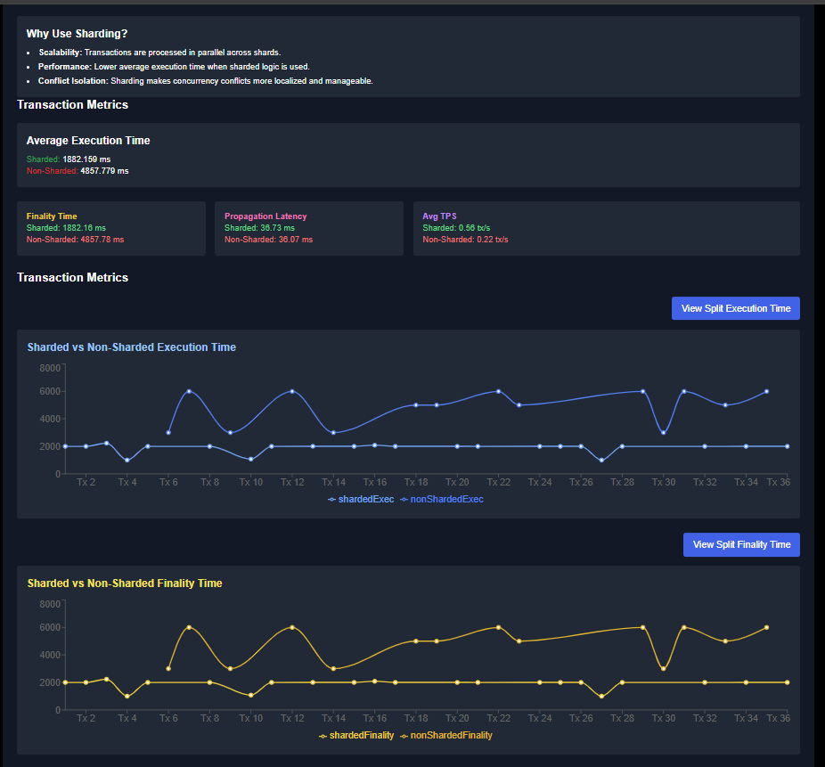
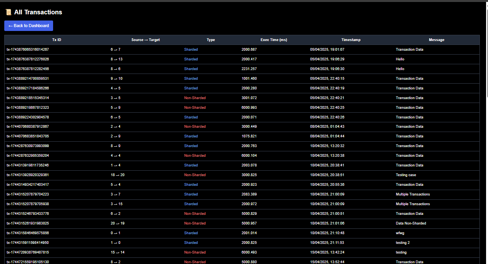
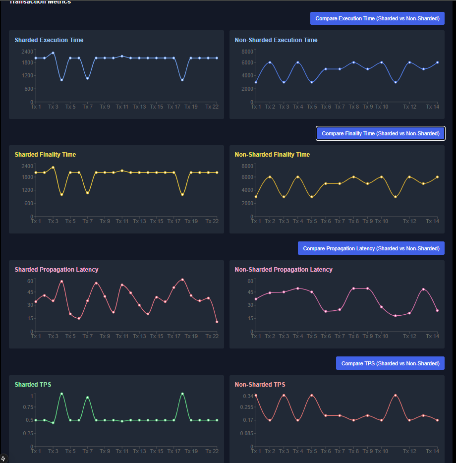
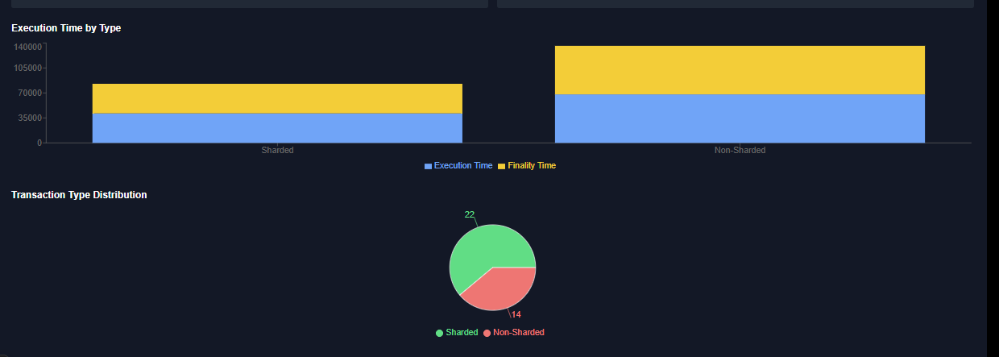

# Blockchain Concurrency Confliction Resolution

An MEng Final Year Project - Blockchain platform for resolving concurrency conflicts using sharding and MVCC principles, with full visualisation, benchmarking, and persistent Firebase logging.

---

## Project Overview

This project showcases a scalable, conflict-resilient blockchain system built with a Go-based backend and a React-based frontend. It supports:

- Concurrent transaction execution
- Sharding with MVCC conflict resolution
- Interactive dashboard with ReactFlow
- Firebase integration for persistent logging and recovery
- Performance benchmarking: execution time, finality, propagation latency, TPS

---

## Why Use Sharding?

> **Scalability**: Transactions execute in parallel across shards.  
> **Performance**: Lower average execution time for sharded workloads.  
> **Conflict Isolation**: Sharding reduces concurrency bottlenecks.

---

##  Project Structure

```
Blockchain-Concurrency-Confliction-Resolution/
├── Blockchain_Codebase/         # Go-based blockchain logic
│   ├── firebase.go              # Firebase integration
│   ├── block.go                 # Core blockchain types & logic
│   ├── working_main.go         # Main server logic
│   ├── sharding.go             # Shard creation and mapping
│   └── blockchain-visualizer/  # ReactFlow UI frontend
├── chaincode/                  # Fabric chaincode (smart contracts)
├── fabric-samples/             # Hyperledger Fabric network setup
├── fablo-target/               # Artifacts for Docker-based Fabric startup
├── backup/                     # Historical copies and recovery
├── README.md                   # This file
```

---

##  Transaction Metrics (Visualised)

The system logs each transaction with detailed metrics:

| Metric               | Description                                             |
|---------------------|---------------------------------------------------------|
| `txID`              | Unique transaction identifier                          |
| `source → target`   | Block-to-block routing                                 |
| `type`              | `Sharded` or `Non-Sharded`                             |
| `execTime` (ms)     | Time to execute the transaction                        |
| `finality` (ms)     | Time from submission to full confirmation              |
| `propagation` (ms)  | Network latency between blocks                         |
| `TPS`               | Transactions per second at the time of submission      |
| `timestamp`         | Time of submission                                     |

---

## 📊 Visual Dashboard

Transactions are pulled directly from **Firebase Firestore** and shown in ascending timestamp order:

### All Transactions View


### 📈 Performance Metrics:

## 🔀 Sharding Architecture Example


### 🕒 All Transactions Table


### 📈 Graphical Execution Timings (Sharded vs Non-Sharded)


### ⌛ Piechart & Execution Time / Finality Overview 


---

## Firebase Integration

All transaction logs are saved to Firestore (`transactions` collection), including performance details and timestamps for analytics. This enables persistence across system restarts and supports dashboard loading from historical data.

Sample Firestore entry:
```json
{
  "txID": "tx-17443889221333985170",
  "source": 1,
  "target": 2,
  "type": "Sharded",
  "execTime": 1000.744,
  "finality": 1000.744,
  "tps": 1.0,
  "timestamp": "2025-04-05T22:40:22",
  "message": "Transaction Data",
  "propagation": 35
}
```

---

## Setup Instructions

### Prerequisites
- Go >= 1.23.2
- Node.js + npm
- Docker + Docker Compose (for Fabric)
- Firebase Admin SDK JSON (ignored in Git)
- WSL2 (if on Windows)

### Cloning the Repo
```bash
git clone https://github.com/ConnorM2020/Blockchain-Concurrency-Confliction-Resolution.git
cd Blockchain-Concurrency-Confliction-Resolution
```

### Backend (Go)
```bash
cd Blockchain_Codebase
./startFabric.sh
./blockchain_app --server -process
```

### Frontend (ReactFlow)
```bash
cd Blockchain_Codebase/blockchain-visualizer
npm install
npm run dev
```

---

## Contributors
- ConnorM2020  (📌 Main Developer, UI + Backend)

---

## 📄 License
This project is licensed under the **MIT License**. Feel free to adapt and reuse.

## 📬 Contact
- GitHub: [ConnorM2020](https://github.com/ConnorM2020)
- Email: Available via GitHub Profile

---


